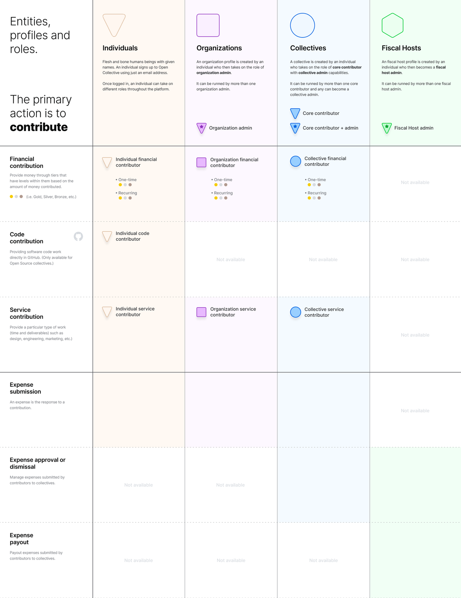

# Terminology

## We are all individuals

**The first thing we all have to understand is that we are all** _**individuals \(users\)**_**.** People can form organizations and collectives. Organizations and collectives are _tools_ which purpose is to serve individuals to put their efforts together to sustain and amplify their collaborative impact.

That said, inside OpenCollective.com there are different _**entities**_ that define the interaction between individuals inside the OpenCollective environment.

## Entities & structure

### Individuals   

Flesh and bone humans beings with given names. An individual signs up to Open Collective using just an email address.  Once logged in, an individual can take on different roles throughout the platform... 

### Organizations  __ 

An Organization is a profile where the individuals connected to it represent a particular legal entity in the world, with a shared bank account, credit card, and resources.

* _**Organization Admins:**_  These are the individuals that create the organization profile and who then take part in running it. They have rights to edit the settings of the organization, set up recurring and/or one-time contributions to a collective and cancel recurring contributions, setup gift-cards, among other things.

### Fiscal Hosts  

Fiscal hosting enables Collectives to transact financially without needing to legally incorporate. A fiscal host is a legal company or individual who holds a Collective’s funds in their bank account, and can generate invoices and receipts for contributors. You can think of a fiscal host as an umbrella organization for the Collectives in it.

* _**Fiscal Host Admin:**_  These are the individuals that create the Fiscal Host who then take part in running it. It can be run by more than one fiscal host admin.
* Admins of [Fiscal Hosts](../hosts/) manage the entities that provide the bank account that makes accepting money possible. 
* Host admins want tools and workflows to easily manage their tasks \(paying expenses and approving new Collectives\). They need to charge their fees and keep a useful accounting system. They are often the first point of contact for the Core Contributors of Collectives they host, and many are super-users.

### Collectives  

The primary entity and the most representative of the ideological basis of our platform.

* _**Core Contributors:**_   These are all the individuals that take part in running a collective.
* _**Collective Admins:**_  These individuals are core-contributors that have been given full-edition capabilities over the collective’s settings, make contributions to other collectives, approve and dismiss expenses, and receive messages sent to the collective. \(info@collectivename.opencollective.com\)
* They are often community organizers or maintainers of open source projects.
* Core Contributors want to make their communities sustainable financially, so receiving financial contributions from organizations and individuals is first on their priority list. They use tools like [tiers](../collectives/tiers.md), [goals](../collectives/goals.md), and [social media sharing](../collectives/integrations.md#twitter-integration). They are interested in managing and growing their communities by creating [events](../collectives/events.md) and [sending updates](../collectives/communication.md).

#### Event Attendee

Attendees are individuals  who register to a Collective's event. They often arrive through a direct link provided by the event organizers. They want a smooth, hassle-free experience, clear information about the event, and ideally a pathway to stay in touch or become Backers.

#### Open Collective Chapter

An Open Collective Chapter is a regional or topical version of Open Collective. For example, we have [Open Collective Paris](https://opencollective.com/paris) that is dedicated to foster an ecosystem of open collectives in Paris. We also have the [Open Source Collective](https://opencollective.com/opensource) that enables open collectives for open source communities all around the world.

## User actions & relationships


#### Every action inside OpenCollective is contribution-based.


> The word we will use for "someone who contributes to a project" is "contributor". The buttons on tiers will say "contribute".

## Financial Contributions

### **Organizational Financial Contributor**  

A company that supports a Collective financially, often at a higher tier.

Sponsors have more complex requirements because they are an [Organization](../backers-and-sponsors/organizations.md) with accounting and reporting needs. They may want brand exposure, access to or goodwill from a community, tangible benefits like support, or help with recruiting efforts.

### **Individual Financial Contributor**  

Support a Collective financially, with a repeating or one-off contribution.

They arrive at a Collective many ways:

* Search from [homepage](https://www.opencollective.com)
* [Discover page](http://opencollective.com/discover)
* Direct link to a Collective
* [Github badges on readme](../developers/readme-integration.md)
* Sponsor's page
* [BackYourStack](https://www.backyourstack.com)
* Our [blog](https://medium.com/open-collective) or newsletter

#### Report an expense

An individual request an economic remuneration as a result of a specific type of contribution made to the collective.

### There are two different formats to contribute financially:

* One-time financial contribution
* Recurring financial contribution

## Non-financial Contributions

### Fiscal hosting  

The way organizations can support collectives by providing the fiscal structure needed to accept money and make payments while taking on the legal and fiscal responsibilities.

### Code Contribution  

An individual can contribute with code \(software\) to the open source project that owns the collective.  \([Bounties](https://docs.opencollective.com/help/developers/bounties)\)

### Service Contribution  

An individual can contribute with time spent servicing the collective, wether is economically remunerated or not.

