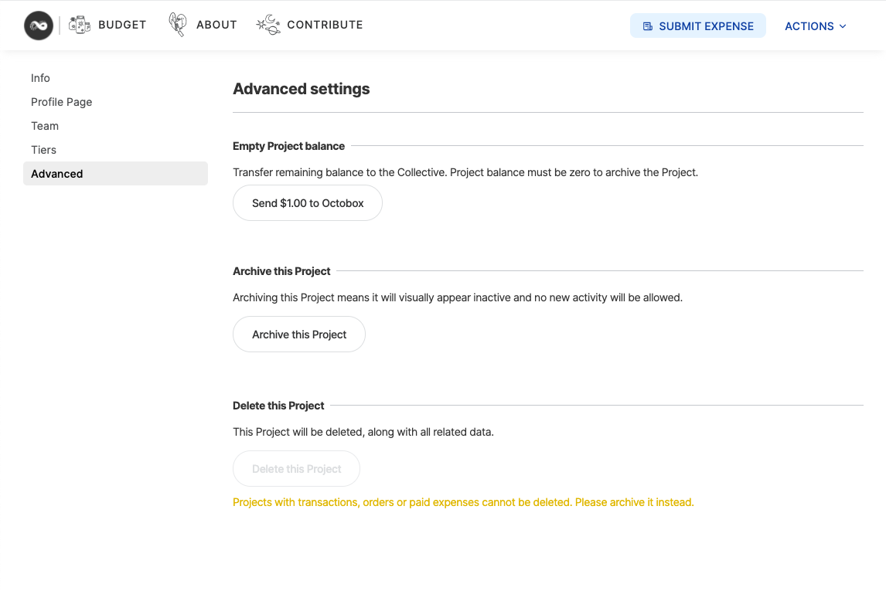

# Projects

Projects are a lightweight way for collectives to manage budgets for initiatives independent of their parent collectives. Use a project if:

* You would like to collect funds for a specific initiative or idea
* You would like to allocate part of your collective's budget to a specific initiative 
* You would like to track the spending on a specific initiative separate from the rest of your collective

Projects have many of the same features as Collectives. Projects have their own balances, contributions, and expenses. Projects can describe contribution tiers, set goals, and provide updates. 

Budgets are independent. Projects can only spend what is allocated to them. And what is available within the project is not available from the parent Collective.

### Creating a Project

Administrators can create a project from the collective profile page. Once you have registered an account and created a collective you can create a project by clicking 'create project' in the Projects area on your collective's profile page. You'll be asked to provide a project name, a URL and a description of your project:

### Editing a project

Projects have many of the same features that Collectives have. Clicking 'settings' from the project's page will open the project settings page where you can:

* Edit the basic information about your Project
* Customise the Project's profile page
* Add contribution tiers and goals

### Managing Project team members

You cannot add, remove or edit team members for projects separately from its parent Collective. The parent Collective's team members are all team members for any Projects in the Collective. 

### Creating an Update

Updates are disabled by default on projects. To enable updates for a project click 'settings' within the project's profile page, select 'profile page' in the sidebar and select 'always visible' or 'only for admins' from the Updates dropdown under the 'Connect' section.

Once enabled administrators can create and publish updates using the same steps described for Collectives.

### Moving funds from Collectives to Projects

To move funds from a Collective to a Project:

1. Navigate to the Project profile page
2. Click 'Contribute money' from the Actions dropdown
3. Select the right amount and frequency \(one time, monthly, yearly\) and click 'your info'
4. Select the parent Collective from the 'Contribute as' dropdown  
5. Select the Collective's balance as the payment method


There is currently an issue with this feature. To show the 'contribute money' button the project needs to have at least one contribution tier set.  


### Zeroing a balance and closing a Project

If you wish to close down a Project you can Archive it or Delete it, in either case you will need to zero the project balance.

From the Project profile page click 'Settings' and select 'Advanced' from the sidebar:

From here you can move the Project's remaining budget to its parent Collective and archive a Project, disabling any future activity. If there has been no financial activity you can delete the Project, removing all of the data associated with the Project. 

Note that, like Collectives, you cannot delete a project if there are financial transactions associated with it. This enables us to ensure the accuracy and integrity of the ledger.

