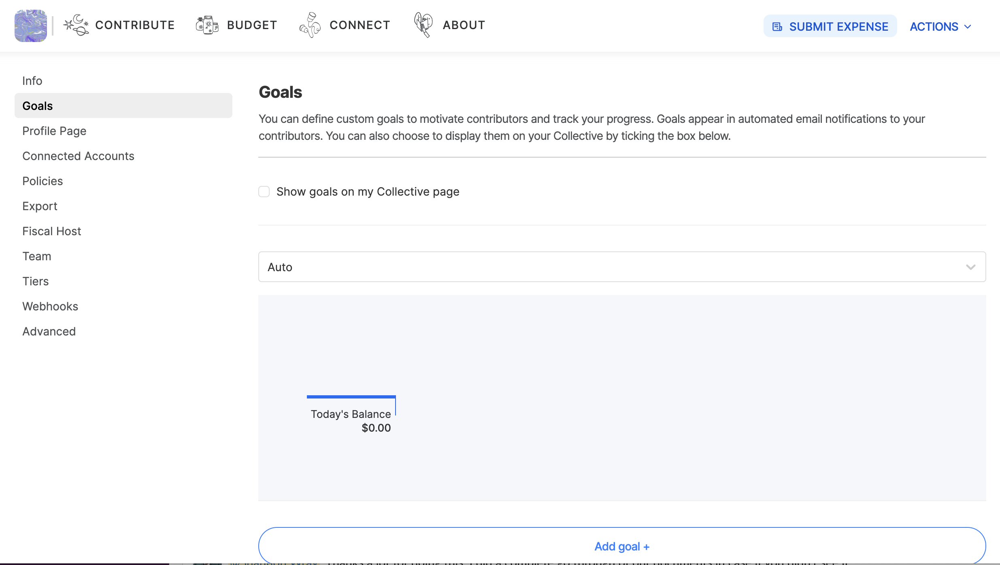
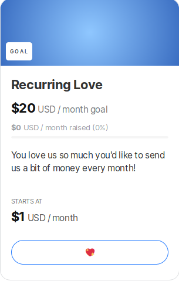
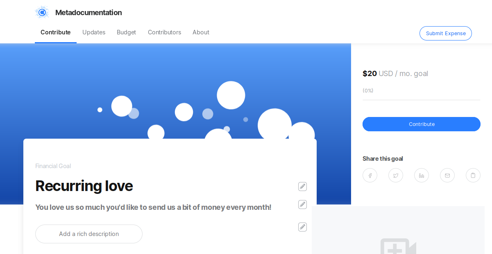
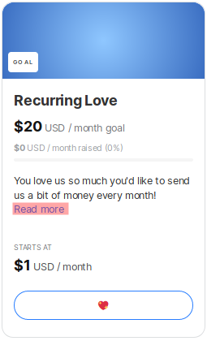

# Collective Goals & Tiers

## Goals

You can define custom goals to share an overview of your financial plan with your community and to track your progress.


Collective Goals will be sent in the emails sent to your contributors, and you can adjust their visibility on your Collective page.


To create your own Collective goals, go to your Collective profile, click on **Settings** and then on **Collective Goals**.

To create a goal, give it a **title**, categorize it as either a goal **balance** or **yearly budget,** specify the **amount** you need and add a **description**. Don't forget to **save** your changes when you're done!

## Tiers

You can also control contributions and tiers by accessing the **Tiers** section.

### Enabling custom contributions

You can define whether you can to allow custom contributions or not by manipulating the **Enable custom contributions** checkbox.

### Creating custom tiers

You can also create custom tiers on the same page. Click on **add another tier** to activate the following form:

### Configuration for Tiers

#### **Type**

Generic, membership, service, product, donation.

#### **Name**

e.g. _Gold Sponsor, Member, Supporter._ This is the only required field to add a new Tier with the default values; all others are optional.

#### **Description**

Important information for Financial Contributors such as what does this tier mean or which rewards are included.

#### **Interval**

The frequency in which such contribution will be charged. It can be a one time contribution, a monthly one, yearly or flexible. 

#### **Amount type**

Fixed or flexible. Flexible amounts can be adjusted by users as they wish.

#### **Suggested amounts**

Suggestions for contributors to pick from.

#### **Default amount**

A preset starting amount.

#### **Minimum amount**

The minimum amount allowed for this contribution, if any.

#### **Available quantity**

For limited edition contributions \(such as special edition items, one-time events, etc\).

#### **Button text**

The action word on the Tier card users click \(such as donate, join, contribute\). You can also add emojis if you wish!

#### **Goal**

Target amount you're trying to raise in this Tier.

#### **Force standalone page**

If you want to force the creation of a page for this tier. Here's what it looks like:

You can access it from your Collective page by clicking on **Read more**.

To add more Tiers, click the blue "add another tier" button.

Don't forget to **save** your changes so they show up on your Collective page.

## Support Tiers

A great way of having more companies supporting your project is by offering them a support tier, where you offer access to support in exchange for financial contributions. Companies may or may not use it but it gives them the peace of mind to have someone who knows the code base very available to help them within a reasonable time frame.

An example is [Babel's Base Support Sponsor](https://opencollective.com/babel#contribute) tier.

Here is a template for a basic support tier for your collective:

> Become a Base Support Sponsor with a yearly donation of $24,000 \($2k/month paid in full upfront\). Get your logo on our README on Github and on the front page of our website, as well as access to up to 2 hours of support per month. Support will be remote with the option of a share screen or via private chat.

With the above tier example, your responsibilities as a Collective are:

* Adding the sponsor's logo on your website
* Merging the Open Collective's PR on your readme to show their logo \(or doing one yourself\)
* Engaging with them to provide the support you've agreed to via the channels specified

The Sponsor's responsibilities are:

* Contacting you with via the specified channels 
* Limiting their support requirements to the time slots specified
* Scheduling the time slots at least a week in advance

## FAQ

### For Collectives

#### How do I define the price?

It depends on a lot of things but mainly on how critical is your open source project to the organization \(which is arguably quite subjective\). We recommend to start at $500/month with a yearly commitment \($6k up front\) for access to two hours of support a month. As you grow, you can start increasing the price.

#### Why a yearly commitment?

It's easier for companies to budget services for the year. It also ensures that they contribute to the maintenance of the project.

### For companies

By subscribing to a support tier, you not only get private time for your team to discuss the open source project that you are depending on, but you are also helping the collective to maintain it. It's a great way to balance your interests with the interests of the community.

#### Do I get an invoice?

Yes, you will receive an invoice emitted by the host of the collective \(Open Source Collective 501c6\).

#### Can I do a Purchase Order \(PO\)?

Yes, you can pay with a credit card or we can work with you to go through your Purchase Order process. Just reach out to us: host+c6@opencollective.org.

#### What if we never were provided with support?

Please reach out to us and we will work it out \(support@opencollective.com\).

