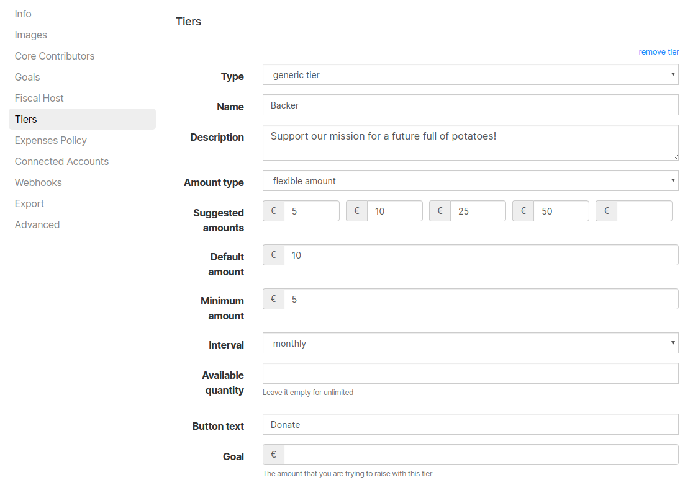

# Tiers & Goals

Use tiers to define different amounts for financial contributions. Tiers can also have associated goals.

To update them, go to 'edit Collective', and head to the 'Tiers' section.

#### Configuration for Tiers:

* **Type:** generic, membership, service, product, donation
* **Name:** e.g. _Gold Sponsor, Member, Supporter_
* **Description:** What this tier means or reward included
* **Amount type:** fixed or flexible \(users can adjust it\)
* **Suggested amounts:** default options for contributors to pick from
* **Default amount:** pre-set starting amount
* **Minimum amount:** for tiers that have a minimum
* **Interval:** Once, monthly, or yearly
* **Available Quantity:** if you want the Tier to be limited \(for unlimited leave empty\)
* **Button text:** the action word on the Tier card users click \(eg. donate, join, contribute\)
* **Goal:** target amount you're trying to raise in this tier \(leave blank if none\)

To add more, click the blue "add another tier" button.

Don't forget to **save** your changes ****so they show up on your Collective page.

## Support Tiers

A great way of having more companies supporting your project is by offering them a support tier, where you offer access to support in exchange for financial contributions. Companies may or may not use it but it gives them the peace of mind to have someone who knows the code base very available to help them within a reasonable time frame.

An example is [Babel's Base Support Sponsor](https://opencollective.com/babel#contribute) tier.

Here is a template for a basic support tier for your collective:

> Become a Base Support Sponsor with a yearly donation of $24,000 \($2k/month paid in full upfront\). Get your logo on our README on Github and on the front page of our website, as well as access to up to 2 hours of support per month. Support will be remote with the option of a share screen or via private chat.

With the above tier example, your responsibilities as a Collective are:

* adding the sponsor's logo on your website
* merging the Open Collective's PR on your readme to show their logo \(or doing one yourself\)
* engaging with them to provide the support you've agreed to via the channels specified

The Sponsor's responsibilities are:

* Contacting you with via the specified channels 
* Limiting their support requirements to the time slots specified
* Scheduling the time slots at least a week in advance

## FAQ

### For Collectives

#### How do I define the price?

It depends on a lot of things but mainly on how critical is your open source project to the organization \(which is arguably quite subjective\). We recommend to start at $500/month with a yearly commitment \($6k up front\) for access to two hours of support a month. As you grow, you can start increasing the price.

#### Why a yearly commitment?

It's easier for companies to budget services for the year. It also ensures that they contribute to the maintenance of the project.

### For companies

By subscribing to a support tier, you not only get private time for your team to discuss the open source project that you are depending on, but you are also helping the collective to maintain it. It's a great way to balance your interests with the interests of the community.

#### Do I get an invoice?

Yes, you will receive an invoice emitted by the host of the collective \(Open Source Collective 501c6\).

#### Can I do a Purchase Order \(PO\)?

Yes, you can pay with a credit card or we can work with you to go through your Purchase Order process. Just reach out to us: host+c6@opencollective.org.

#### What if we never were provided with support?

Please reach out to us and we will work it out \(support@opencollective.com\).

