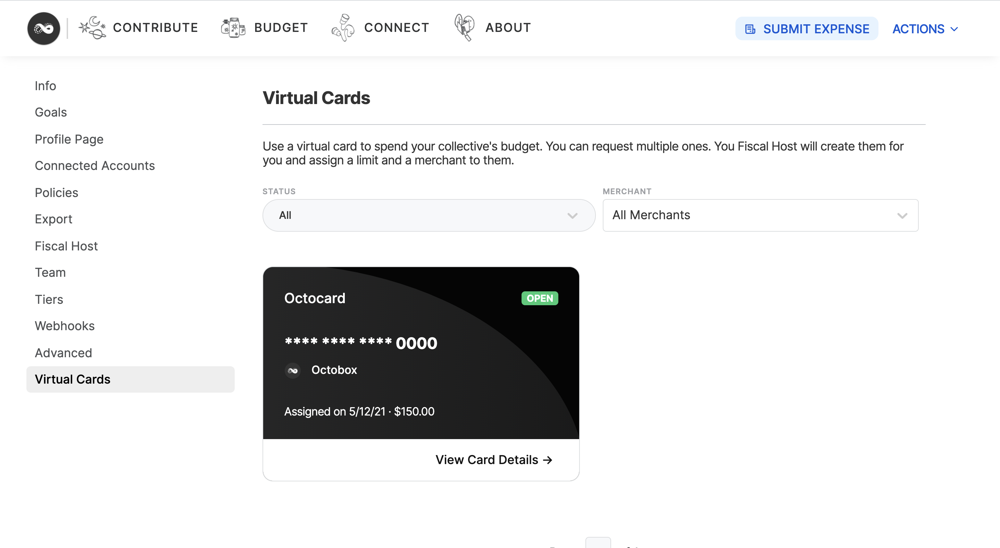

# Virtual Cards

Virtual cards are an additional benefit offered to collectives through hosts. Hosts create virtual cards and assign them to a Collective. Anyone with access to that card can then use it to make payments on behalf of the Collective. This is particularly useful for covering recurring costs like hosting a website.


We have had ongoing issues with virtual cards and it's taking a lot longer than we hoped to fix, so I want to let you know what's going on.

First of all, I'm sorry for the frustration this is causing. Our own cards have been frozen as well, affecting our core operations, and we have been in contact with many of you, so we are very aware that this is causing problems.

Basically, every time anything goes wrong with any card, such as someone tries to charge beyond the card's limit or any other issue, the card provider (Privacy) is shutting down our entire account and freezing every card. We are actively trying to get them to tell us how to avoid this, and see if they can just freeze the affected card instead of all of them, but we have not yet been able to solve it.

In parallel, we are seeking a new virtual card provider as fast as possible. But that will take time, both to get the account set up and to reconfigure the OC platform to work with the new virtual card system.

For now, we have paused requests for new virtual cards. We encourage you to submit expenses instead of using virtual cards where possible. If a vendor can accept ACH or Paypal instead of a credit card we can probably find a way to pay them.

I understand that alternative payment methods are not always possible - all we can do is say we're sorry and we're trying to reactivate existing cards as fast as we can. We will keep you informed.


## Requesting a card

Some Hosts accept requests for virtual cards. If you would like to request a Virtual Card select 'request card' from the 'action' menu on your collective's profile page.

.png>)

## Using a virtual card

Virtual cards can be used to make purchases on behalf of your collective. Each card has an individual who is assigned the card for the purpose of filing expenses. Expenses are automatically created when the card is used and the assignee will be notified.

Please note that our payments provider Privacy.com does not accept payments to money transfer services like PayPal, Payoneer or Paysend. Attempts to pay for services via these providers will be declined.

_In addition, some providers — most notably Google — do not accept virtual cards as a legitimate payment mechanism. We are monitoring this situation while the service is in Beta. _

## Viewing card details

To view virtual cards associated with a collective select 'virtual cards' from the Collective Settings menu:

To view the details of a card click 'view card details'.

## Automatically Paused Cards

Hosts can choose to pause virtual cards if there are any incomplete expenses. This is a protective measure to prevent abuse. If your host has paused a card you will not be able to use the card to make purchases until a receipt has been attached to the previous expense by the assignee.


Be aware of your surroundings when viewing a card's details as others may be able to see them.


### **Companies that don't accept Virtual Cards **

There are a few websites that don't accept prepaid cards. 

* Google 
* Zipcar
