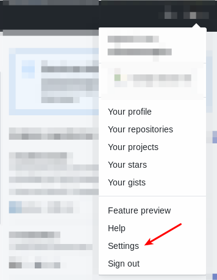
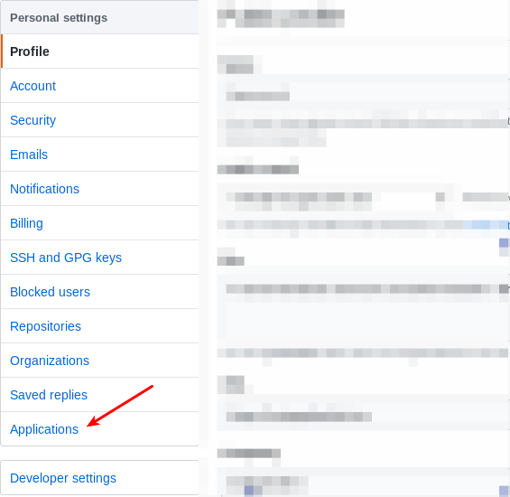
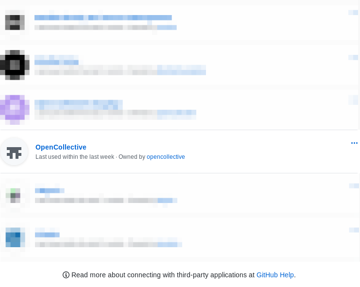
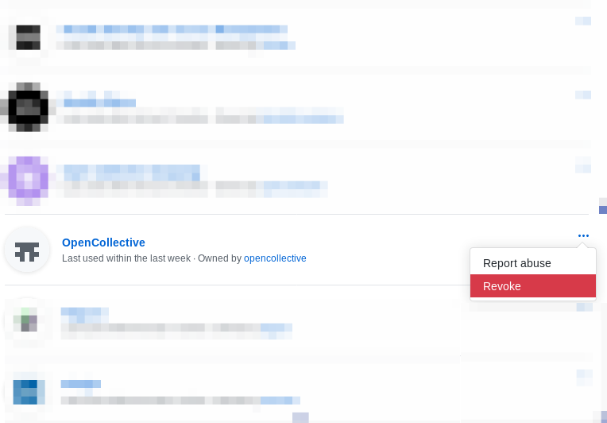
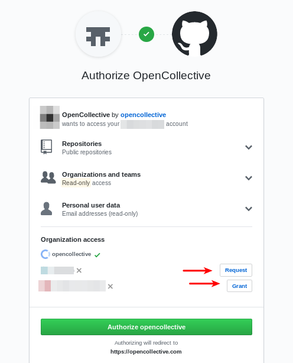

# Open Source Collective

## The Open Source Collective

We have created a non-profit, the Open Source Collective 501c6 in the United States to act as a fiscal sponsor to host all open source projects. This makes it easy for companies to donate to your project since they can receive one consolidated invoice.

### What services does the Open Source Collective provide?

This host organization provides invoices and request for funds for your sponsors, onboards as a vendor in their system, receives bulk payments, manages relevant tax forms and checkout processes from other revenue streams \(like Threadless, carbon ads and affiliate programs\).

### What is the cost?

The Open Source Collective 501c6 is taking 5% of all donation received \(on top of the 5% for the Open Collective platform\). This is to cover the administrative overhead, accounting, legal. That way you never have to worry about all that boring stuff and you can focus on your project.

### What are the Terms of Fiscal Sponsorship?

You can find them [here](https://docs.google.com/document/u/1/d/1HRYVADHN1-4B6wGCxIA6dx28jHtcAVIvt95hkjEZVQE/pub)

### How do I apply?

If you think this works for you, go ahead and create your collective selecting **Open Source Project** in [opencollective.com/create ](https://opencollective.com/create)to apply to this host. If you'd rather become your own host, select **Other** and you'll be able to set up your own host in the process. Note that in that case, you will be responsible for doing the accounting as well as facilitating payments from sponsors.

### **Troubleshooting**

#### The permissions you ask for are overly generous and my organization doesn't want to grant them.

We agree the permissions are overly generous. Unfortunately, there's not much we can do at the moment since this is the only scope we can use to read the info we need. We've discussed this at length on issues [\#355](https://github.com/opencollective/opencollective/issues/355), [\#1034](https://github.com/opencollective/opencollective/issues/1034) and [\#2333](https://github.com/opencollective/opencollective/issues/2333).

If you have any suggestions on how to handle this better, feel free to join the discussions, start a new one, or send us an email [support@opencollective.com](mailto:support@opencollective.com).

#### I can't find my repository or my organization's repository.

There are a few possible causes for that:

**\#1: You may be using the wrong GitHub account in the authorization process**

If you believe that you may have linked the wrong GitHub account to your Open Collective account, you will need to manually revoke access from the current linked GitHub profile. You can do that by either accessing [https://github.com/settings/applications](https://github.com/settings/applications) or following our guide:

1. On GitHub, go to **Settings**.

2. On the Settings menu, click on **Applications**.

3. On the **Applications** page, open the **Authorized OAuth Apps** tab and look for Open Collective..

4. Click on the three dots on the right labelled "Show me more options" to revoke the authorization.  

**\#2: You used the right account, but you didn't grant access to organization repositories**

During the authorization process, GitHub lists the organizations in which you are a member. Depending on [the permission level](https://help.github.com/en/github/setting-up-and-managing-organizations-and-teams/permission-levels-for-an-organization) you have at each one of them and their [third party access policy](https://help.github.com/en/github/setting-up-and-managing-organizations-and-teams/enabling-oauth-app-access-restrictions-for-your-organization), you may have to either grant permission on that page or request it.

#### My repository is listed but I can't create a collective \(Error: We could not verify you are the admin of the GitHub organization\).

Depending on [the permission level](https://help.github.com/en/github/setting-up-and-managing-organizations-and-teams/permission-levels-for-an-organization) you have at an organization, you may not be authorized to perform that action. Contact other members of your organization to discuss that process.

#### There are too many repositories listed on my page. How can I find the right repository?

Use the search bar to filter repositories by name:

