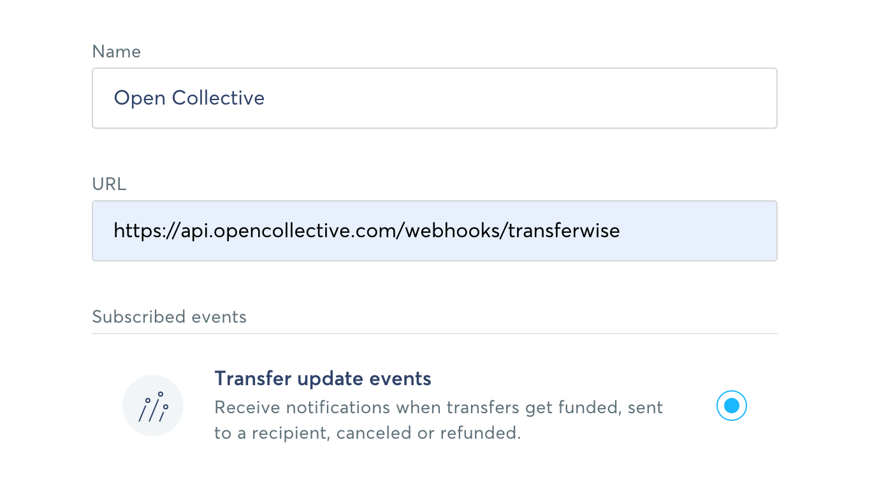

# Payouts with TransferWise

TransferWise integration can be used to automate expense payment as a way to provide one-click wire transfer for expenses.

After connecting your TransferWise account, users submitting new expenses will have access to a structured form for providing a valid bank account information and you will be able to pay those expenses automatically with the _Pay with TransferWise_ button.

## Limitations

* Payments through TransferWise require a borderless account.
* The host is still responsible for managing funds in TransferWise.
* Transfers are funded with your host currency.
    * If your host is using USD, we're funding all your transfers with your USD balance.

## Connecting TransferWise

TransferWise is currently in beta test, if you're interested in testing this feature, please reach out through support@opencollective.com.

If you're already in the beta test group, you can follow these instructions:

1. Go to your settings menu in TransferWise

    

2. Generate and copy a new _API token/key_:
   * As a security measure, make sure you whitelist the IPs `54.173.229.200` and `54.175.230.252`

     
3. Create a new Webhook:
   * Point it to our URL `https://api.opencollective.com/webhooks/transferwise`.
   * Select _Transfer update events_ events.

     
4. Go to your Host settings page in Open Collective
5. Open the Connected Accounts tab
6. Paste the newly created _API key_ in the TransferWise field and click connect

    

## Reducing Risks

In order to reduce risks related to having an active API token that is able to create and fund transactions, we strongly suggest you to:

1. White list our fixed IPs
2. Keep just enough balance in TransferWise to pay your expenses
   * This can be achieved by calculating the amount needed for the current payment cycle and transferring it beforehand.

## Troubleshooting

* `Unable to fund transfer`
    * You don't have enough funds in your host's currency balance. Please add funds and try again.
