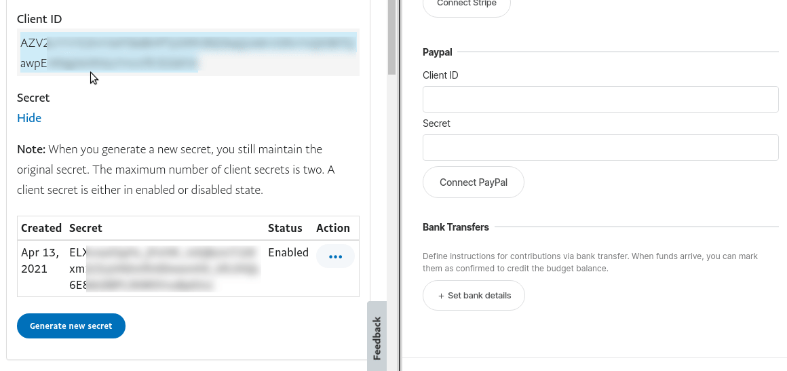

# Payouts with PayPal

There are two ways you can process expenses using PayPal: using PayPal Adaptive Payments or PayPal Payouts.

## PayPal Payouts


**This feature is not supported for independent collectives. If you are an independent collective we recommend using Wise for payouts.**


For hosts that are using PayPal, this integration can be used to automate expense payment by providing a one-click solution for paying expenses using [PayPal Payouts](https://developer.paypal.com/docs/payouts/).

After connecting your PayPal account, you'll be able to schedule expenses submitted using PayPal as a payout method for mass-payout without needing to reauthorize with PayPal every $2,000 USD. Expenses scheduled for payout also have a higher limit (up to $20,000 per expense) and cheaper fees, you can schedule expenses for payout up to your existing PayPal balance.

### How does it work?

The new payment process is asynchronous, meaning that expenses are now scheduled for payout and dealt with by a scheduled worker. This worker runs **once every hour**, this means that at the turn of the clock we'll bundle the scheduled expenses and pay them in a single request to PayPal.

After being processed by the worker, the expense is marked as in _**Processing**_ and individually tracked. We'll make sure its status is up-to-date on our platform, bear in mind that in the case the recipient doesn't have a PayPal account, they have up to 30 days to create and accept the payment.

If the payment is successful, the expense is marked as _**Paid**_, and in case something goes wrong during this process the expense will be marked as _**Error**_ so you can try it again or process it manually.

### Fees

#### What are the fees involved?

The fees are charged by PayPal and its value will vary with the currencies being and value being transferred. You can read more about it [here](https://developer.paypal.com/docs/payouts/standard/reference/fees/).

#### Who pays for the fees?

These fees are paid by the collective the expense was submitted for. This means that transactions in PayPal will display the fees but that value will also be deducted from the collective balance in our platform as a _payment processor fee_.

.png>)

### Limitations and Prerequisites

* A PayPal business account with:
  * Access to PayPal Payouts.
    * There's a manual request that needs to be filled, [more information here](https://developer.paypal.com/docs/payouts/standard/integrate-api/#link-knowbeforeyoucode).
  * A confirmed identity, email, and bank account linked to your PayPal business account.
  * Sufficient funds in your PayPal business account.
* Payments should respect the fund amount you have accounted for in the platform.
  * You can't pay expenses if the budget accounted for the collective is not enough to cover the transfer expenses.
* The host is still responsible for managing funds in PayPal.
  * Expenses are paid with your PayPal Balance.

### Connecting to PayPal Payouts


**PayPal Payouts is currently in beta test, if you're interested in testing this feature, please** [**contact us**](https://opencollective.com/contact)**.**&#x20;


If you're already in the beta test group, you can follow these instructions:

1.  Create a new PayPal app

    * Open [PayPal's Developer](https://developer.paypal.com/developer/applications/) page and Log In.
    * In _My Apps & Credentials_ page, select the **Live** environment, and click in _Create app_.

    

    * Name this App after Open Collective, this way you'll always remember where this token is being used.
    * App Type: Merchant
    * Click _Create App._

1. Now, copy the necessary information to Open Collective.
   * Open a new tab and go to [Open Collective](https://www.opencollective.com).
   * Open your Host collective settings page and click on the _Sending Money_ option in the menu.
   * Copy and paste _Client ID_ and _Secret_ in the respective fields.
   * Click _Connect PayPal_

Done! Next time you pay for an expense submitted with PayPal and you select the automatic method, your expense will be marked as _Scheduled for Payment_ and processed using PayPal Payouts!

.png>)

### Reducing Risks

In order to reduce risks related to having an active API token that is able to create and fund transactions, we strongly suggest you:

* Keep just enough balance in PayPal to pay your expenses.
  * This can be achieved by calculating the amount needed for the current payment cycle and transferring it beforehand.

## Adaptive Payments


PayPal adaptive is deprecated and will be removed soon. Please migrate to PayPal payouts if you're currently using it.


Adaptive Payments are the easy way and it is automatically enabled for everyone.

From your host dashboard, you can connect your PayPal account and pre-approve up to $2,000 USD in payouts. Make sure that you are connecting the PayPal account connected to the same bank account as your Stripe account.

On the host dashboard, expenses that have been approved and have a sufficient budget will show a "pay" button. With just one click you can pay the expense. After paying out $2,000, you'll need to re-authorize with PayPal (this is a security feature).

For single payments larger than $2,000, make a manual payment

## Disconnect from Paypal&#x20;

1. Click on the admin button on the top right hand side of your fiscal host page.&#x20;

<figure><figcaption></figcaption></figure>

2\. Go to your Fiscal host settings

<figure><figcaption></figcaption></figure>

&#x20;

3\. Click on Sending money

&#x20;

<figure><figcaption></figcaption></figure>

4\. Disable Paypal&#x20;

<figure><figcaption></figcaption></figure>
