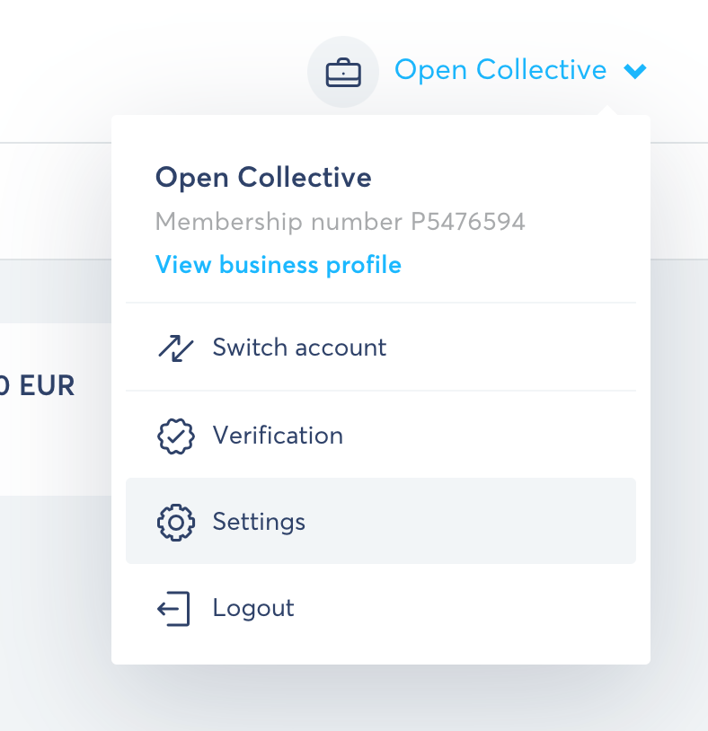
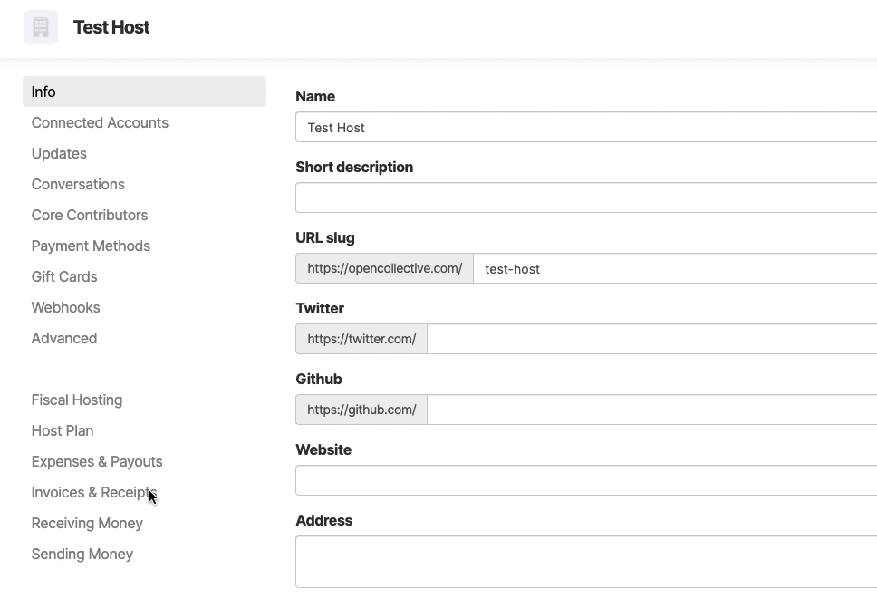
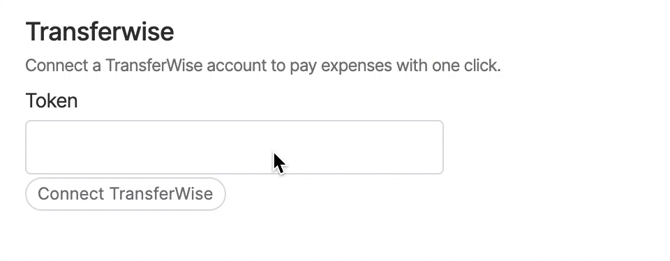

# Payouts with TransferWise


This feature is currently in **Beta** test, [read more about it here](payouts-with-transferwise.md#the-beta-test).


For hosts that are using TransferWise, this integration can be used to automate expense payment by providing a one-click solution for paying expenses.

After connecting your TransferWise account, users submitting new expenses will have access to a structured form for providing a valid bank account information and you will be able to pay those expenses automatically with the _Pay with TransferWise_ button.

## Fees

### What are the fees involved?

The fees are charged by TransferWise and its value will vary with the currencies being and value being transferred. You can read more about [TransferWise fees here](https://transferwise.com/help/13/understanding-fees-and-rates/2522717/how-do-you-determine-your-fees).

### Who pays these fees?

These fees are paid by the collective the expense was submitted for. This means that transactions in TransferWise will display the fees but that value will also be deducted from the collective balance in our platform as _payment processor fee_.

## The Beta test

We're currently testing this feature with the help of selected Host collectives.

If you're interested in testing this feature, please reach out through support@opencollective.com. If you're already testing the feature and wish to leave the test, you can also send an email to support.

## Limitations

* Payments through TransferWise require a borderless account.
* Payments should respect the fund amount you have accounted for in the platform.
  * You can't pay expenses if the budget accounted for the collective is not enough to cover the transfer expenses.
* The host is still responsible for managing funds in TransferWise.
  * Transfers are funded with your host currency.
    * If your host is using USD, we're funding all your transfers with your USD balance despite the payee currency.

## Connecting TransferWise

TransferWise is currently in beta test, if you're interested in testing this feature, please reach out through support@opencollective.com.

If you're already in the beta test group, you can follow these instructions:

1. Open TransferWise website and log in into your borderless account;
2. Go to your settings menu in TransferWise;

   

3. Select _API tokens_ and then _Add new token:_ 
   * Name this token after Open Collective, this way you'll always remember where this is being used.
   * Set the token permission to _Full access_, we'll need that to create and fund transactions for your expenses.
   * As a **security measure**, make sure you whitelist the IPs `54.173.229.200` and `54.175.230.252`. 
   * Click on _Create token_ and then on _Reveal key_ and \_\_**Copy the API key** you generated.
4. Now, open a new tab and go to [Open Collective](https://www.opencollective.com).
5. Open your Host collective settings page and click in the _Sending Money_ option in the menu.       
6. Paste the _API Token_ you created in the TransferWise field and click connect;

   

7. Now, back in TransferWise settings!
8. Select _API tokens_ and then _Manage Public Keys:_  \_\_
9. Add our public key clicking on _Add new key_:
   1. Click on _Continue_;
   2. If you have 2-step authentication activated, authenticate with your token;
   3. Name this key after Open Collective.
   4. 5. Download and add <a href="https://raw.githubusercontent.com/opencollective/documentation/v2/files/oc-public.pem" download>our Public Key</a>.
   6. Click on _Add Key._
10. Lastly, we'll create a webhook to make sure transactions are updated in realtime, for that we'll return once again to your TransferWise settings page;
11. Select _Webhooks_ and then _Create a new webhook_: 
    * Name this webhook after Open Collective.
    * Point it to our URL `https://api.opencollective.com/webhooks/transferwise`.
    * Select _Transfer update events_ events.
    * Click on _Create webhook._

      
12. Done! Now all your hosted collectives will be able to submit Bank Transfer expenses compatible with TransferWise and you'll be able to pay for it with one click.
    * Notice that this option will only be available for new expenses, expenses created before these steps are not structured as required by TransferWise and will need to be edited or recreated by the payee.

## Reducing Risks

In order to reduce risks related to having an active API token that is able to create and fund transactions, we strongly suggest you to:

1. White list our fixed IPs when creating your API token.
2. Keep just enough balance in TransferWise to pay your expenses.
   * This can be achieved by calculating the amount needed for the current payment cycle and transferring it beforehand.

## Troubleshooting

* `Unable to fund transfer`
  * You don't have enough funds in your host's currency balance. Please add funds and try again.

