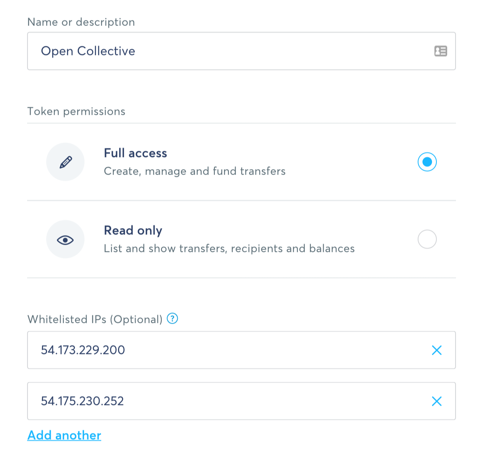

# Payouts with TransferWise


This feature is currently in **Beta** test, [read more about it here](payouts-with-transferwise.md#the-beta-test).


For hosts that are using TransferWise, this integration can be used to automate expense payment by providing a one-click solution for paying expenses.

After connecting your TransferWise account, users submitting new expenses will have access to a structured form for providing a valid bank account information and you will be able to pay those expenses automatically with the _Pay with TransferWise_ button.

## The Beta test

We're currently testing this feature with the help of selected Host collectives.

Given its requirements, testing this feature will also enable the new Expense submission form, which is part of the next iteration on the redesign Expense flow we're shipping soon.

This means that you're not only signing up for the TransferWise beta test, you're also testing the new expense form. Notice that there are a few caveats related to this:

1. Expenses will start need to be created through the new form with a new URL ending in `/v2`.
   * Example: `https://opencollective.com/engineering/expenses/new/v2`
2. All existing "Submit Expense" buttons, on every hosted collective, are going to point to this new URL.

If you're interested in testing this feature, please reach out through support@opencollective.com. If you're already testing the feature and wish to leave the test, you can also send an email to support.

## Limitations

* Payments through TransferWise require a borderless account.
* Payments should respect amount of funds you have accounted for in the platform.
  * You can't pay expenses if the budget accounted in the collective is not enough to cover the transfer expenses.
* The host is still responsible for managing funds in TransferWise.
  * Transfers are funded with your host currency.
    * If your host is using USD, we're funding all your transfers with your USD balance.

## Connecting TransferWise

TransferWise is currently in beta test, if you're interested in testing this feature, please reach out through support@opencollective.com.

If you're already in the beta test group, you can follow these instructions:

1. Open TransferWise website and log in into your borderless account;
2. Go to your settings menu in TransferWise;

   

3. Create a new _API token/key:_
   * Make sure to copy the API key you generated.
   * As a **security measure**, make sure you whitelist the IPs `54.173.229.200` and `54.175.230.252`.

     
4. Create a new Webhook:
   * Point it to our URL `https://api.opencollective.com/webhooks/transferwise`.
   * Select _Transfer update events_ events.

     
5. Open your Host collective settings page and click in the "Sending Money" option in the menu;
6. Paste the newly created _API key_ in the TransferWise field and click connect;

   

7. Done! Now all your hosted collectives will be able to submit Bank Transfer expenses compatible with TransferWise and you'll be able to pay for it with one click.
   * Notice that this option will only be available for new expenses, expenses created before these steps are not structured as required by TransferWise and will need to be edited or recreated by the payee.

## Reducing Risks

In order to reduce risks related to having an active API token that is able to create and fund transactions, we strongly suggest you to:

1. White list our fixed IPs when creating your API token.
2. Keep just enough balance in TransferWise to pay your expenses.
   * This can be achieved by calculating the amount needed for the current payment cycle and transferring it beforehand.

## Troubleshooting

* `Unable to fund transfer`
  * You don't have enough funds in your host's currency balance. Please add funds and try again.

