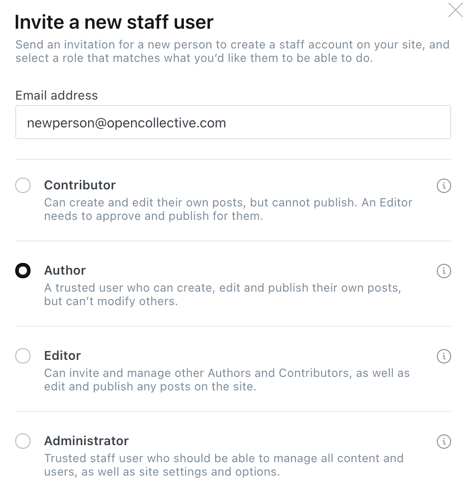
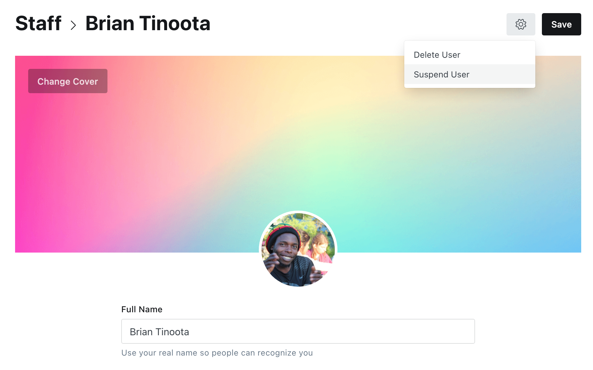
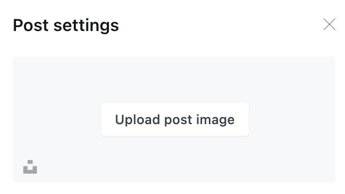

# Blog

The Open Collective blog lives [here](https://blog.opencollective.com/).

## Using Ghost

Open Collective uses [Ghost](https://ghost.org/), an open-source blogging platform. Reach our Ghost dashboard [here](https://opencollective.ghost.io/ghost/#/site).

#### Shared login account

We use one single team account to log in \(credentials in 1Password\). This is because Ghost charges per active user account, and we don't need multiple accounts for our purposes.

When writing a blog post, the author will default to this generic shared user account \(called Open Collective\), but it's much better to have a human author attributed. 

To set yourself or someone else as the author, select them in the 'authors' dropdown in post settings, then delete the 'Open Collective' author from this field.

#### Create an author

To create a new author profile, go to the Staff settings and click 'invite people'. Put in their email and set their permissions to 'author' \(or editor or admin if they are a core OC team member\).

The new person will receive an email invitation, and they'll be able to click through and set up their photo and bio.

Once they have created their profile, go to the Staff settings, click on their name, then click the gear, and select 'suspend user'. Their account will remain selectable as an author but they will not be able to log in directly. This way, we will not be charged extra for their account.

#### Guest Authors

All blogs should be published by OC core staff. If a guest author is invited to create a profile for their post, the OC staff member should still be the one to actually publish the content \(selecting the guest author as the named author in the post settings\). This is another reason it's important to suspend new author accounts after they are set up.

## Publishing guidelines

#### Content

In terms of content, anything related to Open Collective, or Hosts and Collectives on the platform, is welcome.

#### Authorship

Select a human author for posts where possible. Otherwise, the group authors can be used \(Open Source Collective, Open Collective Foundation, etc\).

#### Tags

All posts must have at least one tag, and ideally at least one of the top-level tags linked in the blog navbar: Case Studies, News, or How-to. This top-level tag should be the first tag so that it shows up next to the date in the header. 

Tags are also used for external direct links to that collection of posts, e.g. the OSC website links to posts tagged "osc" via [https://blog.opencollective.com/tag/osc/](https://blog.opencollective.com/tag/osc/), so it can be useful to add multiple tags besides the top-level ones.

If you wish to create a new tagged collection of posts, create the tag, add it to the relevant posts, and then link to it using the tag URL formal above.

#### Post image

All posts must have an image added in settings, even if you choose not to display the image in-line in the post itself. Otherwise, posts look out of place on the blog homepage and lack an image preview when shared on social media. 

To add a post image, go into post settings and upload one.

#### URLs

Pay attention to the URL in post settings before publishing. If you've set a title and later changed it, the auto-generated URL will be from the old title. 

Often, auto-generated URLs are long and unwieldy, so edit it to something short and descriptive. E.g. the post titled "Supporting an Ethereum ecosystem with the OASIS Baseline Protocol" has a URL of simply [https://blog.opencollective.com/baseline-protocol](https://blog.opencollective.com/baseline-protocol/).

#### Titles

We aren't trying to create clickbait, but choose titles that are likely to catch a reader's attention, and keep them succinct and to the point. Pick out the most important part of the message and make it the title. 

Titles should not have a full stop \[**.**\] at the end, but may end in question marks \[?\] or exclamation points \[!\].

#### Sub-headings

The first line after the title is what will get pulled through as the description on social media, and is the first chance to draw in the reader. It's great if the title and sub-heading can together tell a mini-story that will invite people to click through and learn more.

## Scheduling

In general, we try to space posts out a little, so that we don't have a bunch in one week and then none for a couple of weeks. The platform newsletter goes out in the middle of each month, but ideally, blog posts wouldn't all bunch up trying to meet that deadline. However, we don't follow a strict publishing schedule.

## Blog Bounties

We have a standing offer of $100  for guest posts from any Collective, Host, or other platform users to tell their story of using Open Collective. The $100 bounty is donated to their Collective upon publication \(after review and editing by an OC core staff member\). When making the contribution, select the Open Collective main profile under 'contribute as'.

