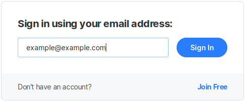

# Log-in System

Open Collective works with a **no-password system,** because our users appreciate not having to remember another password, especially when on mobile.

### **How it works**

You type in your email and the system instantly knows if you're an existing user or a new user.

If you already have an account, we send you an email with a unique link that logs you into Open Collective. You will stay logged in for 30 days on that device.

If you're a new user, you'll be prompted to create an account.

## About security

It might sound counterintuitive, but passwords don’t always make things more secure. They can be hard to remember, and easy for fraudsters to guess. Not everyone uses a password manager, and people often don’t follow good password practices and either reuse passwords, or pick obvious ones \(ie. their country code, their birthday, etc\). Passwords can also make you more vulnerable to [phishing](http://www.phishing.org/what-is-phishing), a type of fraud where someone tricks you into telling them your password.

Most websites allow you to reset your password by email, a feature fraudsters can use to work around any protection provided by a password. These websites start from the premise that if your email is compromised, your account will be too. The main way to avoid that is Two Factor Authentication \(2FA\), which [you can enable](https://docs.opencollective.com/help/fiscal-hosts/payouts/two-factor-authentication-for-payouts#enabling-2fa-for-login) on your Open Collective account.

According to [Auth0](https://auth0.com/blog/is-passwordless-authentication-more-secure-than-passwords/):

> Passwordless authentication, by its nature, eliminates the problem of using an unsafe password. This means that one of the biggest user errors is taken out of your login. Not only is passwordless authentication safe to use, it might even be safer than a traditional username + password login.

In 2020, this login system was audited by [Cure53](https://cure53.de). Their report included recommendations for improving it, but they found no critical issue nor design issue about the way it works today.

Our login system is also covered by our [security bounty policy](https://github.com/opencollective/opencollective/blob/main/BOUNTY.md) ; we invite security researchers \(and pay them\) to try to break our system and improve it.

**Who else uses magic links to login?**

* [Slack](https://slack.com) - a messaging app
* [Monzo](https://monzo.com) - a banking app
* [Scaleway](https://www.scaleway.com) - hosting service \(similar to Amazon AWS\)
* [Sweep Bright](https://www.sweepbright.com/) - a CRM
* [Notion](https://www.notion.so) - a notes app

