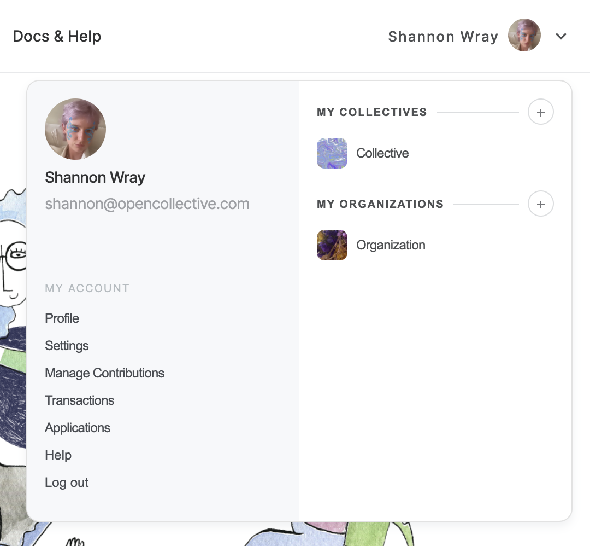
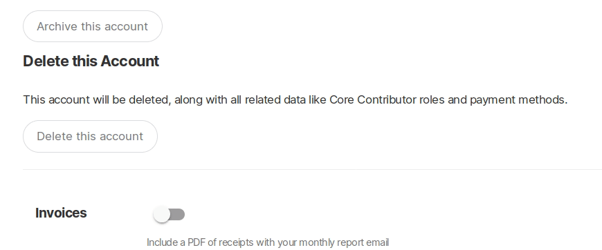
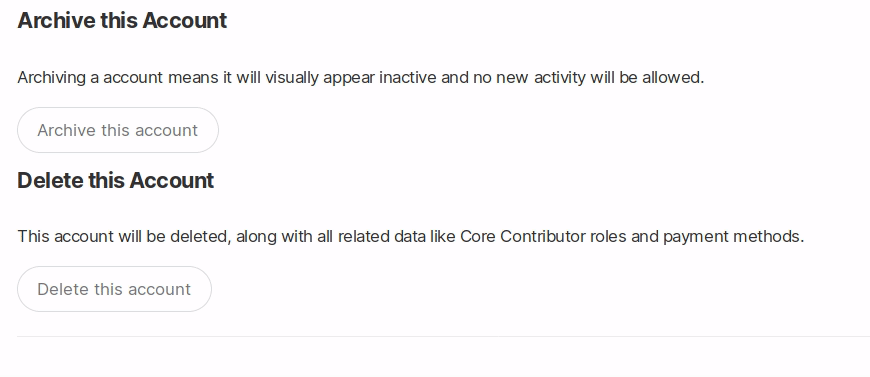

# User Profile

## Your profile

You can use your Open Collective user profile to let people know a bit about you. Projects you back might want to reach out to you, or you may want to use this page to show off your contributions or the Collectives you manage.

You can access your profile settings by using the dropdown menu on your username and going to the **Profile** page.

On your **Profile** page, you are able to customize the following:

### Cover image

The optimal size for a cover image is 2736x650. 

Click on **Edit cover** to access to upload a new cover image.

After uploading a image, you are able to adjust it as you wish by either moving it and zooming in and out.

### Main color

You can either choose any of the preset colors, add your own custom color or reset to the default color.

### Other settings

To access other settings, click on the gear icon next to your profile image.

Here you are able to edit basic info such as **Name**, **Company**, **Short description**, **URL slug**, and access other settings such as **Profile Page**, **Payment Methods**, **Payment Receipts**, **Webhooks, Two-factor authentication** and **Advanced**.

## Advanced settings

### Changing your email address

Go to **Advanced** and specify your new email address in the box under the **Email address** section. You'll get a confirmation and then your new email will be active.

### Deleting your account


You are only able to delete your account if it has no activity registered such as donations and expenses. Therefore, accounts with a history of transactions cannot be deleted —they are part of Collective budgets and their integrity and accuracy depend on those records.


To delete your account, go to the **Delete this Account** section and click on **Delete this account**.

### Archiving your account

If your account has a history of transactions, your only option is archiving your account. Archived accounts will appear as inactive accounts and no new activity will be allowed. Next time we run subscriptions \(1st of the month\), they will be cancelled.

To archive your account, go to the **Archive this Account** section and click on **Archive this account**.

## Using Open Collective Anonymously

You can sign up using a pseudonym. We understand that not everyone can or wants to show their real name on public Collective budgets.

If you are getting paid through the platform, we will need some personally identifiable information. However, these documents \(invoices and tax forms, for example\) are not public and only admins will be able to see them.

